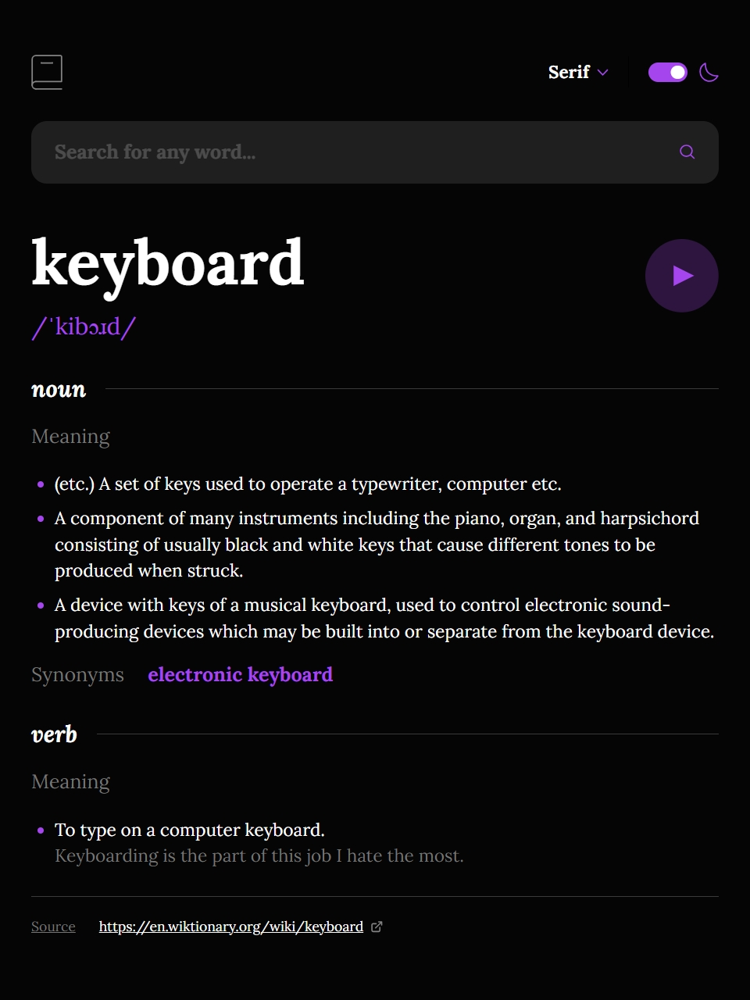
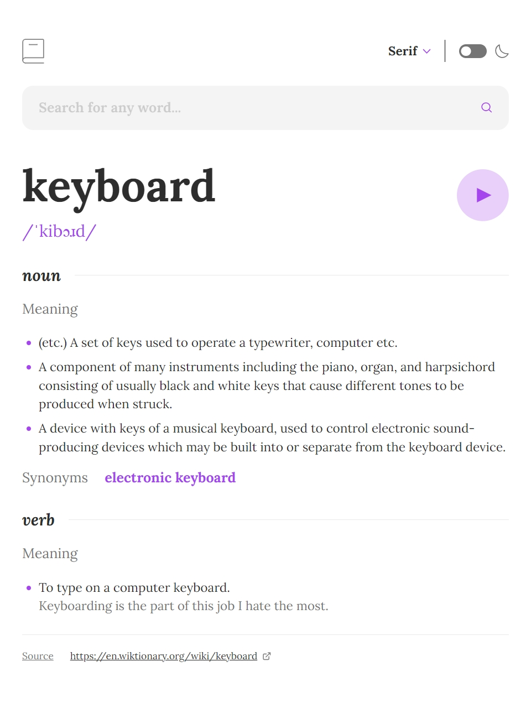

# Frontend Mentor - Dictionary web app solution

This is a solution to the [Dictionary web app challenge on Frontend Mentor](https://www.frontendmentor.io/challenges/dictionary-web-app-h5wwnyuKFL). Frontend Mentor challenges help you improve your coding skills by building realistic projects.

## Table of contents

- [Overview](#overview)
  - [The challenge](#the-challenge)
  - [Screenshot](#screenshot)
  - [Links](#links)
- [My process](#my-process)
  - [Built with](#built-with)
  - [What I learned](#what-i-learned)
  - [Continued development](#continued-development)
  - [Useful resources](#useful-resources)
- [Author](#author)

## Overview

### The challenge

Users should be able to:

- Search for words using the input field
- See the Free Dictionary API's response for the searched word
- See a form validation message when trying to submit a blank form
- Play the audio file for a word when it's available
- Switch between serif, sans serif, and monospace fonts
- Switch between light and dark themes
- View the optimal layout for the interface depending on their device's screen size
- See hover and focus states for all interactive elements on the page
- **Bonus**: Have the correct color scheme chosen for them based on their computer preferences or the one selected in a previous session.
- **Bonus**: Keep the selected font family between sessions.

### Screenshot

**Mobile - Dark**

**Mobile - Light**

**Tablet - Dark**

**Tablet - Light**

**Desktop - Dark**

**Desktop - Light**


### Links

- Solution URL: [Github repository](https://github.com/leididelapuente13/dictionary-web-app.git)
- Live Site URL: [Live site](https://dictionary-web-app-sroc.onrender.com)

## My process

### Built with

- Semantic HTML5 markup
- TailwindCSS
- Flexbox
- Mobile-first workflow
- [Angular](https://angular.dev) - JavaScript Framework
- [Typescript](https://www.typescriptlang.org)

### What I learned

I learned how to handle different font families, how to add the dowloaded fonts files, and how to add custom font sizes. In angular I learned how to have a service that is shared between two components to trigger a resource without repeating code and avoid prop drilling.
I got to use flatMap to convert several arrays into just one.

**Dictionary Mapper:** This helped me to convert the response that I get from the API to one I could easily use in my components structures and to unify several definitions so I disn't have to choose to render justs one.

```ts
export class DictionaryMapper {
  static RestDictionaryEntryToDictionaryEntry(restDictionary: RESTDictionaryEntry): DictionaryEntry {
    const { word, phonetics, meanings, sourceUrls } = restDictionary;

    const phoneticWithAudio = phonetics.find((phonetic) => phonetic.audio !== "");

    return {
      phonetic: {
        word,
        phonetictText: phoneticWithAudio?.text ?? phonetics[0].text,
        audioUrl: phoneticWithAudio?.audio,
      },
      meanings,
      sourceUrls,
    };
  }

  static RestDictionaryEntryArrayToDictionaryEntryArray(restDictionaryArray: RESTDictionaryEntry[]): DictionaryEntry {
    const dictionaryEntries = restDictionaryArray.map((restDictionaryEntry) => this.RestDictionaryEntryToDictionaryEntry(restDictionaryEntry));

    return {
      phonetic: dictionaryEntries[0].phonetic,
      meanings: dictionaryEntries.flatMap((entry) => entry.meanings),
      sourceUrls: dictionaryEntries[0].sourceUrls,
    };
  }
}
```

### Continued development

I would like to keep learning about angular patterns like the facade pattern, explore other alternatives to resource, and learn how I can shared a service without consuming it twice. I also would like to work more with forms to feel more confident working with ractive forms.
In Tailwind I would like to keep practicing configuring font sizes.
I would like to keep practicing working with design files and refining my ability to follow designs.

### Useful resources

- [Avoid prop drilling](https://christiankohler.net/how-to-avoid-prop-drilling-in-angular/) - This is an amazing article that helped me to avoid prop drilling in this application.

## Author

- Github - [Leidi](https://github.com/leididelapuente13)
- Frontend Mentor - [@leididelapuente13](https://www.frontendmentor.io/profile/leididelapuente13)
